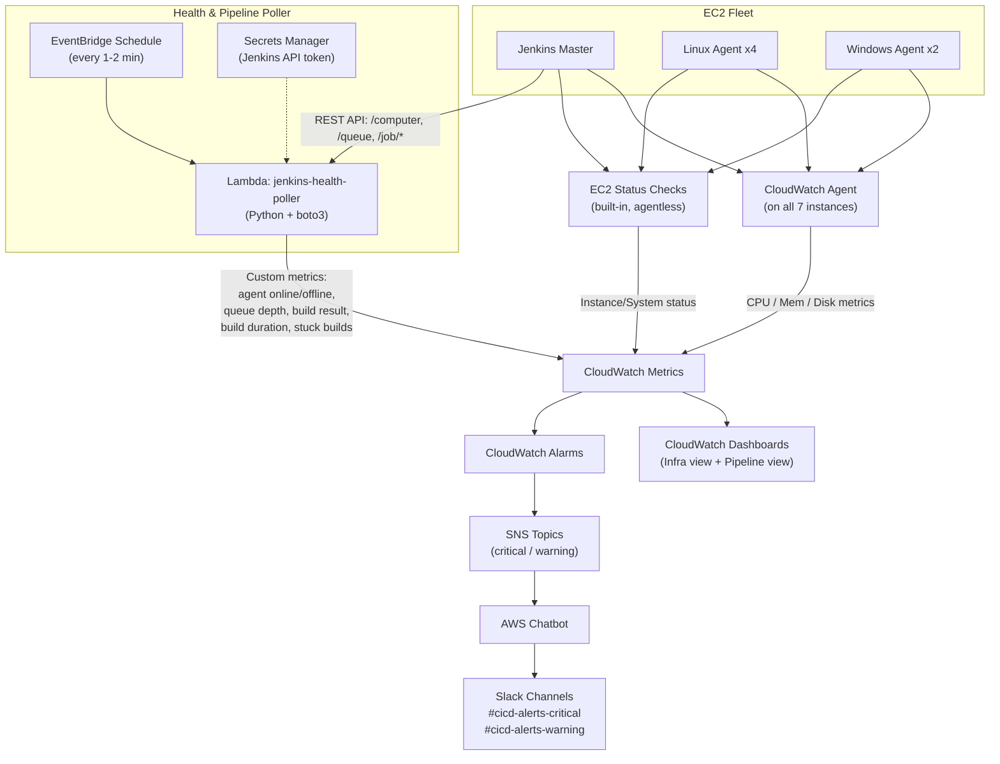

# Jenkins CI/CD Pipeline & Health Monitoring — Architecture

**Status:** Draft v1
**Owner:** abhishekbharadwaj2023@gmail.com
**Last updated:** 2026-08-25

## 1. Goal

Automate monitoring and health-checking of the Jenkins CI/CD platform: the Jenkins **master** (EC2) and its **6 build agents** (4 Linux, 2 Windows), covering both:

- **Infrastructure health** — is each EC2 instance/agent alive, resourced adequately, and connected to Jenkins?
- **Pipeline health** — are jobs succeeding, running in reasonable time, and not piling up in queue or stuck?

Alerts route to **Slack** in near-real time so a human can react before a pipeline outage blocks releases.

## 2. Current environment

| Component | Count | Notes |
|---|---|---|
| Jenkins master | 1 | Runs on EC2, hosts controller UI/API, schedules jobs |
| Linux agents | 4 | EC2, connected via SSH or JNLP |
| Windows agents | 2 | EC2, connected via JNLP (or WinRM) |

Gap today: no automated visibility into agent connectivity, resource exhaustion, or pipeline-level trends (failure rate, queue backlog, stuck builds). Detection is manual/reactive.

## 3. Design decisions

| Decision | Choice | Rationale |
|---|---|---|
| Stack | **AWS-native** (CloudWatch + SNS) | Minimizes new infra to run/patch; integrates directly with existing EC2/IAM; no Prometheus/Grafana server to maintain |
| Alert channel | **Slack** | Via AWS Chatbot (native SNS→Slack integration, no custom Lambda needed for delivery) |
| Monitoring scope | **Infra + pipeline metrics** | Node health (CPU/mem/disk/status) *and* build success rate, queue wait time, build duration, stuck-build detection |
| Out of scope (v1) | Centralized log aggregation | Noted as a Phase 2+ candidate (see §9) |

## 4. Architecture overview

## 5. Components

### 5.1 Instrumentation

- **CloudWatch Agent** — installed on all 7 EC2 instances (master + 6 agents).
  - Linux: standard CloudWatch Agent config collecting CPU, memory, disk (`df`), disk I/O.
  - Windows: CloudWatch Agent with perfmon counters (`Memory\% Committed Bytes In Use`, `LogicalDisk\% Free Space`, `Processor\% Processor Time`), since Windows resource metrics aren't exposed the same way as Linux.
  - Pushes to CloudWatch under a custom namespace, e.g. `Jenkins/Infra`.
- **EC2 Status Checks** — built-in, agentless, catches instance-level and hypervisor-level failures (e.g., instance unreachable) even if the CloudWatch Agent itself has died.
- **`jenkins-health-poller` Lambda** — the piece that captures *Jenkins-level* truth, since an EC2 instance can be "running" while its Jenkins agent connection has dropped:
  - Calls Jenkins REST API (`/computer/api/json`) → per-agent online/offline/idle/temporarily-offline state, executor count.
  - Calls `/queue/api/json` → queue depth and per-item wait time.
  - Calls per-job `/api/json` (or `lastBuild`/`lastCompletedBuild`) → build result (SUCCESS/FAILURE/ABORTED), build duration.
  - Compares in-progress build runtime against a per-job historical baseline (rolling p95) or a configured timeout → flags **stuck builds**.
  - Publishes all of the above as custom metrics to CloudWatch under namespace `Jenkins/Pipeline`.
  - Auth: Jenkins API token stored in **Secrets Manager**, retrieved at invocation (never hardcoded).
  - Trigger: **EventBridge** schedule, every 1–2 minutes.

### 5.2 Metrics & storage

- **CloudWatch Metrics** — two custom namespaces (`Jenkins/Infra`, `Jenkins/Pipeline`) plus native `AWS/EC2` metrics (status checks) feed everything downstream. No separate time-series DB to run.

### 5.3 Dashboards

Two CloudWatch Dashboards:
1. **Infra view** — per-node CPU/mem/disk, EC2 status check pass/fail, agent count online vs expected (6), grouped Linux vs Windows.
2. **Pipeline view** — build success/failure rate (rolling), queue depth over time, average/95th-percentile build duration by job, count of currently-stuck builds.

### 5.4 Alerting

- **CloudWatch Alarms** evaluate metrics against thresholds (see §6) and change state to `ALARM`.
- **SNS topics** — split by severity so Slack routing/urgency can differ:
  - `jenkins-alerts-critical` (e.g., master down, all agents of a type offline, queue backlog blocking releases)
  - `jenkins-alerts-warning` (e.g., single agent offline, disk >80%, elevated failure rate)
- **AWS Chatbot** subscribes to both SNS topics and posts formatted alerts into the corresponding Slack channel — no custom webhook Lambda required, and it supports acknowledging/re-invoking AWS CLI read commands from Slack if useful later.

## 6. Example alarm thresholds (tune after baseline period)

| Metric | Condition | Severity |
|---|---|---|
| Jenkins master EC2 status check | Failed, 2 consecutive periods | Critical |
| Agent online count (per OS type) | < expected (4 Linux / 2 Windows) for 5 min | Warning (1 down) / Critical (≥2 down or all of one OS) |
| Disk free space | < 15% | Warning |
| Disk free space | < 5% | Critical |
| CPU utilization (sustained) | > 90% for 10 min | Warning |
| Build queue depth | > N items for 10 min (N = baseline-derived) | Warning |
| Build failure rate (rolling 1h) | > 30% | Warning |
| Stuck build count | ≥ 1 | Warning |
| Stuck build duration | > 2x job's p95 baseline | Critical |

## 7. Security & IAM

- **Least privilege Lambda role**: `cloudwatch:PutMetricData`, `secretsmanager:GetSecretValue` (scoped to the one secret), CloudWatch Logs write for its own execution logs. Nothing else.
- **Jenkins API token**: stored in Secrets Manager, rotated periodically; a dedicated Jenkins service account with read-only API scope (no build-trigger permissions) is used for polling.
- **CloudWatch Agent IAM role** on each EC2 instance: managed policy `CloudWatchAgentServerPolicy`, instance-profile scoped — no cross-account or broad EC2 permissions.
- **Network**: Lambda reaches Jenkins over the existing VPC (private subnet + security group allowing Lambda's ENI → Jenkins master port 8080/443 only); no public exposure introduced.
- **Chatbot**: IAM role scoped to read-only SNS subscription delivery into the specific Slack workspace/channel — no command-execution permissions granted unless explicitly decided later.

## 8. Implementation phases

| Phase | Scope | Rough effort |
|---|---|---|
| **1. Baseline infra monitoring** | Install CloudWatch Agent on all 7 instances (Linux + Windows configs), confirm EC2 status checks, build Infra dashboard | 2–3 days |
| **2. Pipeline poller** | Build & deploy `jenkins-health-poller` Lambda, Secrets Manager token, EventBridge schedule, Pipeline dashboard | 3–4 days |
| **3. Alerting** | Define alarms (§6), create SNS topics, wire AWS Chatbot → Slack channels, validate end-to-end with a forced failure | 2 days |
| **4. Tune & harden** | Observe 1–2 weeks of real data, tune thresholds/baselines, document runbooks for each alert | ongoing |

## 9. Future enhancements (not in v1 scope)

- Centralized log aggregation (CloudWatch Logs shipping from master/agent + job console output) for faster root-cause on failures.
- Auto-remediation (e.g., Lambda restarts a hung agent's Jenkins service, or triggers an EC2 reboot/replace via Auto Scaling on repeated status-check failure).
- Cost/utilization view — correlate agent idle time with EC2 spend to right-size the fleet.
- If metric/dashboard needs outgrow CloudWatch (e.g., need for ad-hoc querying, long retention, more complex visualizations), revisit a Prometheus + Grafana layer fed by the same exporters, without disturbing the alerting path.

## 10. Open questions

- Exact Jenkins job set / naming convention to scope the Lambda's per-job polling (all jobs, or a folder/tag subset?).
- Retention requirements for build metrics (CloudWatch custom metrics default to 15 months at decreasing resolution — confirm that's sufficient).
- Slack workspace/channel names and who owns the AWS Chatbot Slack app authorization.
